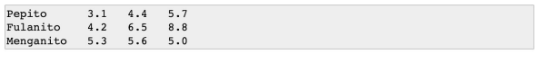

# Topic: Base Shell
Based on the knowledge learned in the Base Shell Exercises course,
complete the following exercises:
Solve the following challenges, at the end you must upload them to
your Github.
1. Make a script called '01holamundo.sh' that displays "Hello world!".
2. Now instead of "world" show the entered parameters ('02hello
parameters.sh').
3. With the previous point that also verifies that we have at least
entered one parameter ('03helloalmenos1parameter.sh').
4. And also separate each argument by "," ('04Hello
separateparameters.sh').
5. Make a script called 'subtraction' that performs the subtraction of 2
entered parameters (you will have to be able to add decimal
numbers, such as 2.2 - 3).
6. Make a script called 'multiply' that multiplies the 2 entered
parameters (you will have to be able to multiply decimal numbers,
like 2.2 * 3).
7. Create by hand a file 'notes.csv' with the following data:

8. Make a script called 'bank' to add, search and list movements bank,
and calculate the account balance.
9. Make a script called 'appointmentsmenu.sh' that is an interface to the
'appointments' script by displaying a menu with the following options:
1. Add a new appointment.
2. Search by patient name.
3. Find appointments by starting hour.
4. Search for appointments by end time.
5. List appointments ordered by patient name. 6. List the
appointments ordered by starting time. 7. Exit the program.
10. Make a script called 'appointmentsflags.sh' to be able to use the
script 'appointments' via CLI.